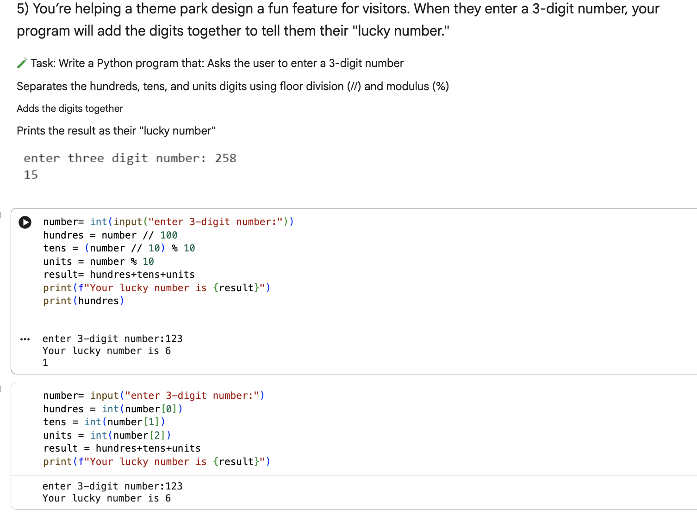
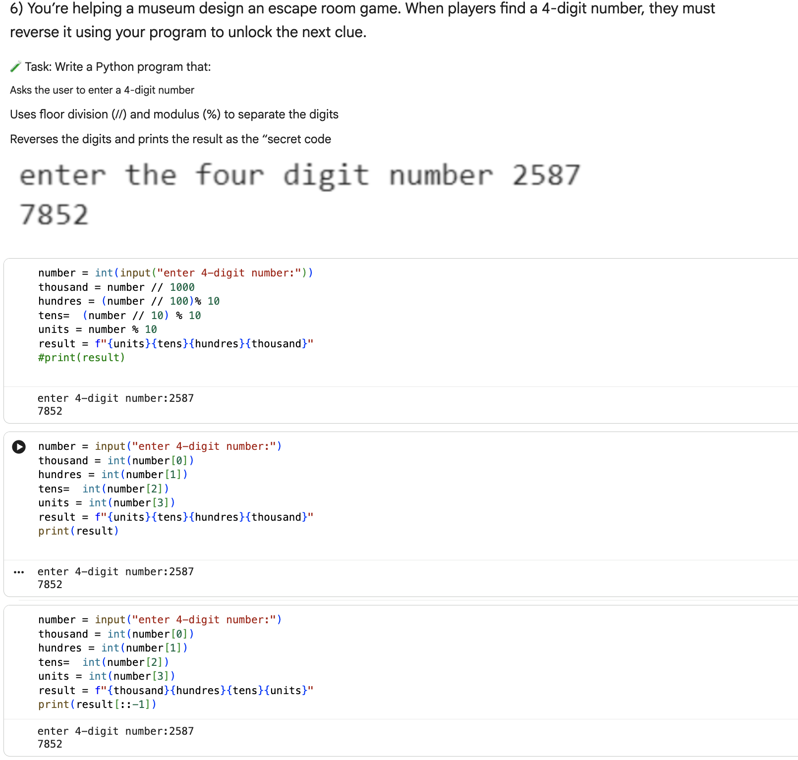
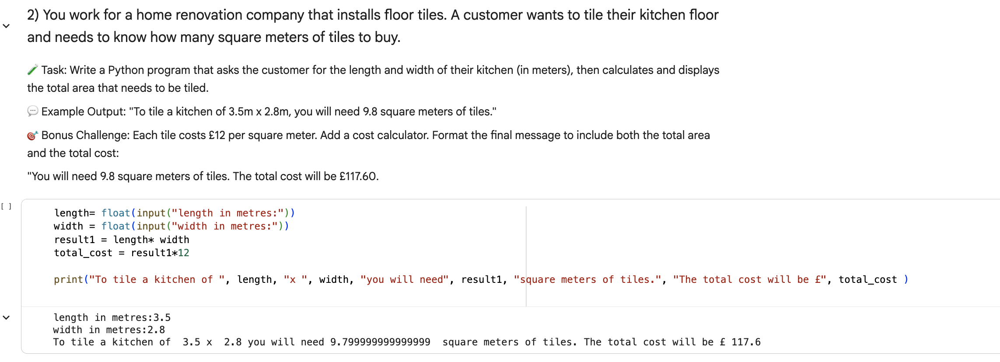
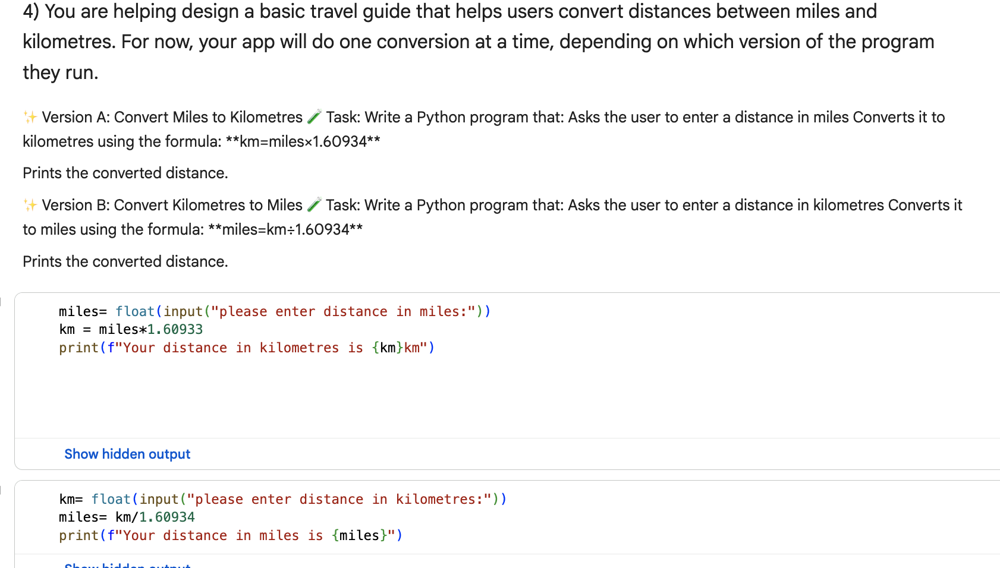

# 🐍 Python Fundamentals Practice Project

## 📘 Overview  
This project focuses on strengthening fundamental Python programming skills through practical exercises. It covers numeric operations, user input handling, and formatted output. Completing this project helped me develop the ability to manipulate numbers, perform calculations,report results clearly.Identify and resolve simple arithmetic errors independently in Python.

---

## 🎯 Key Learning Objectives

### 🔢 Digit Extraction and Manipulation  
Extract digits from numbers using **floor division (`//`)** and **modulus (`%`)** to sum or reverse digits.  

---

### 📐 Geometry Calculations  
Measure and calculate **areas** and **distances** using appropriate formulas.  

---

### 🌡️ User Input Handling  
Accept user input and accurately **convert temperature units** (e.g., Celsius to Fahrenheit).  

---

### ✍️ Formatted Output  
Display results clearly using **formatted strings** and structured output statements.  

---
### 🧠 Skills Developed

 ✅ Core Python syntax and arithmetic operations

 ✅ Logical thinking and problem decomposition

 ✅ Handling and validating user input

 ✅ Using operators effectively for mathematical operations

 ✅ Presenting output clearly and professionally
 
 ---

### 🚀 Future Improvements

💡 Add error handling for invalid input

💡 Expand to more advanced arithmetic and geometry problems

💡 Include more interactive exercises to practice Python fundamentals

---

Thanks for visiting this project! 🚀  
